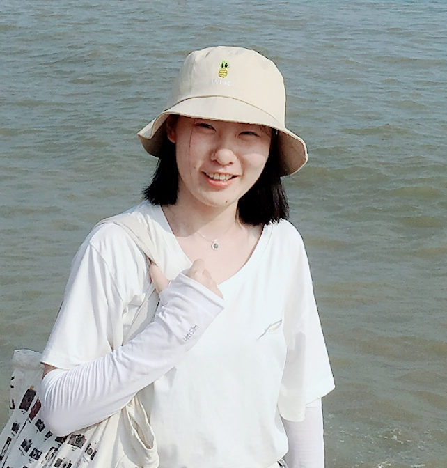
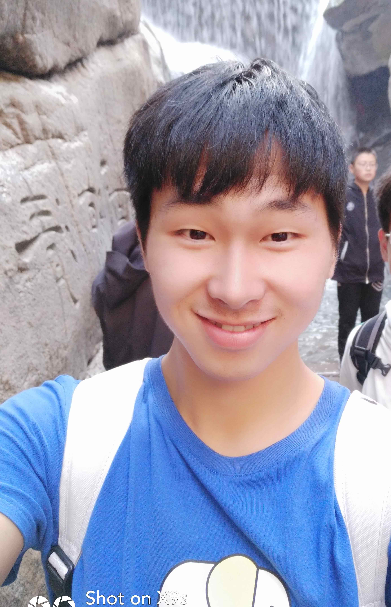
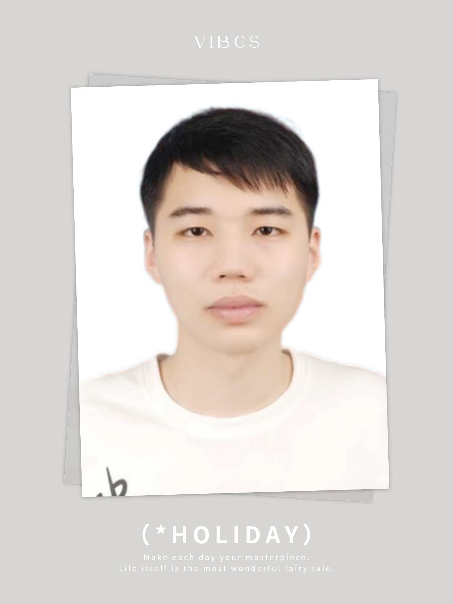
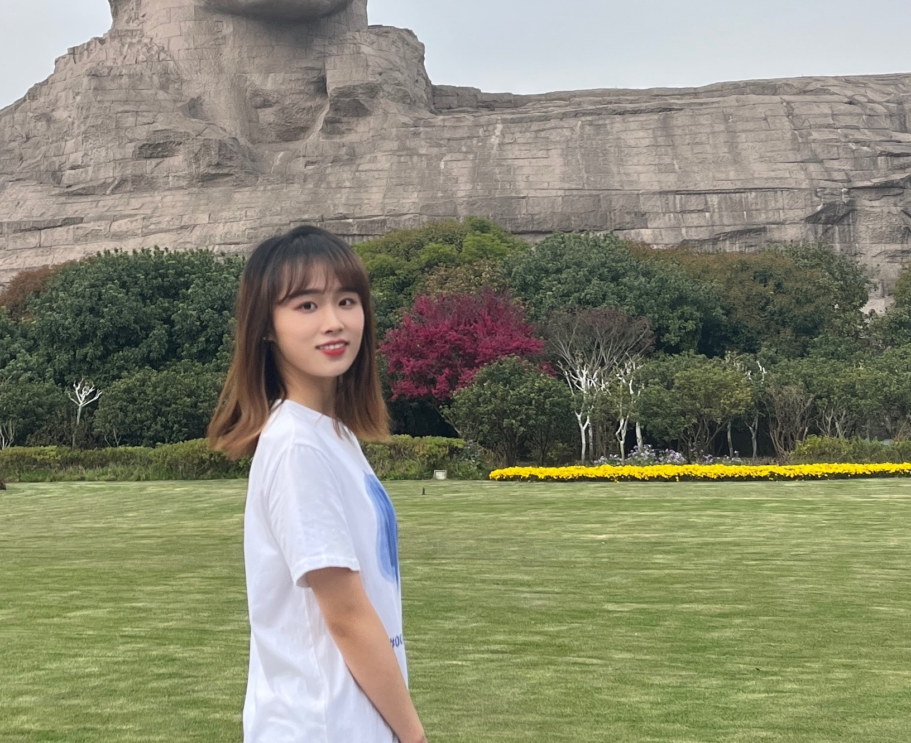
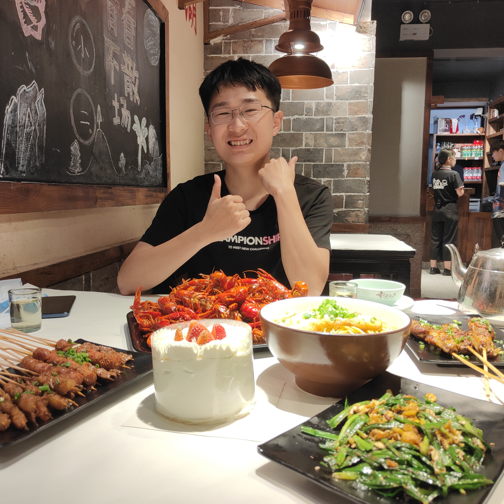
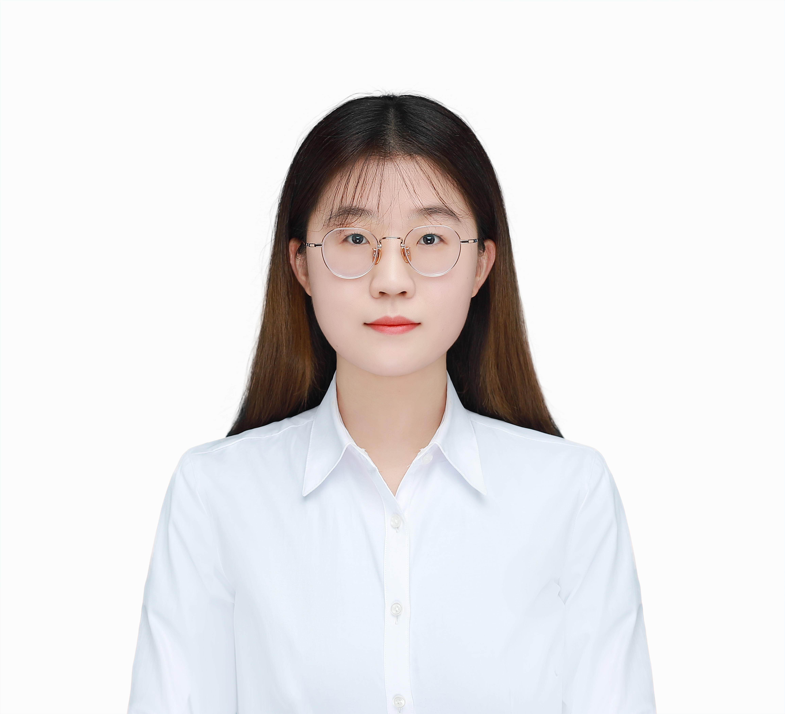

UQ&ML team will focus on the research about uncertainty quantification (UQ) and machine learning (ML).

## 关于招生
每年预计有三个硕士招生指标，欢迎具有数学、统计学、物理学或计算机背景且对统计计算、不确定性量化、机器学习等相关领域感兴趣的同学报考。

关于 UQ&ML 小组的几点提示:
- 每周将有组会进行文献分享和课题进展讨论
- 成员需要具有一定的python代码实现能力

## People

###  M.S. students

-  Ying Zhou (joint with Prof. Lian Wu, 2020-present)
-  Hongji Wang (joint with Prof. Tiexin Guo, 2021-present)
-  Zheng Hu (joint with Prof. Tiexin Guo, 2021-present)
-  Jingyu Yang (joint with Prof. Hebai Chen, 2021-present)
-  Kunyu Wu (joint with Prof. Yong Jiao, 2021-present)
-  Juan Cheng (joint with Prof. Yuanyuan Liu, 2021-present)

### Former undergraduate students

- Qibiao Zhang (2020, M.S., Renmin University of China)
- Yutong Gan (2020, M.S., Hokkaido University)
- Chengling Feng (2020, M.S., Shanghai Jiao Tong University)
- Yuchong Wang (2021, M.S., National University of Singapore)
- Zirui Li (2022,)
- Xiao Zhang(2022, M.S., Central South University)
- Dezhao Yang(2022, M.S., The Chinese University of Hong Kong, Shenzhen)