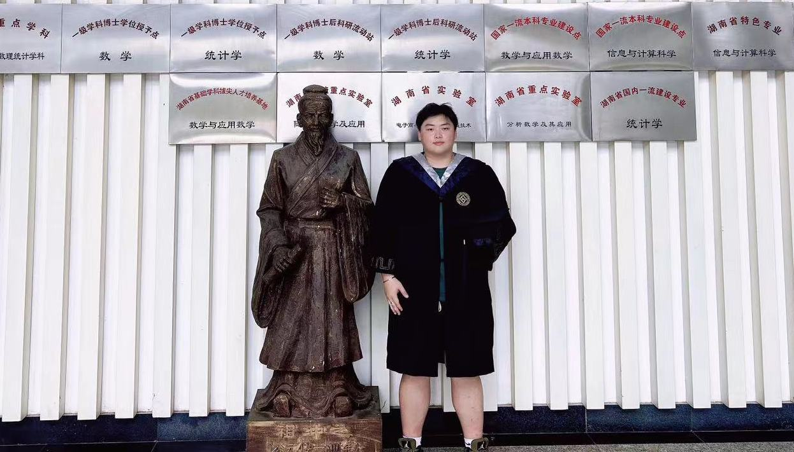
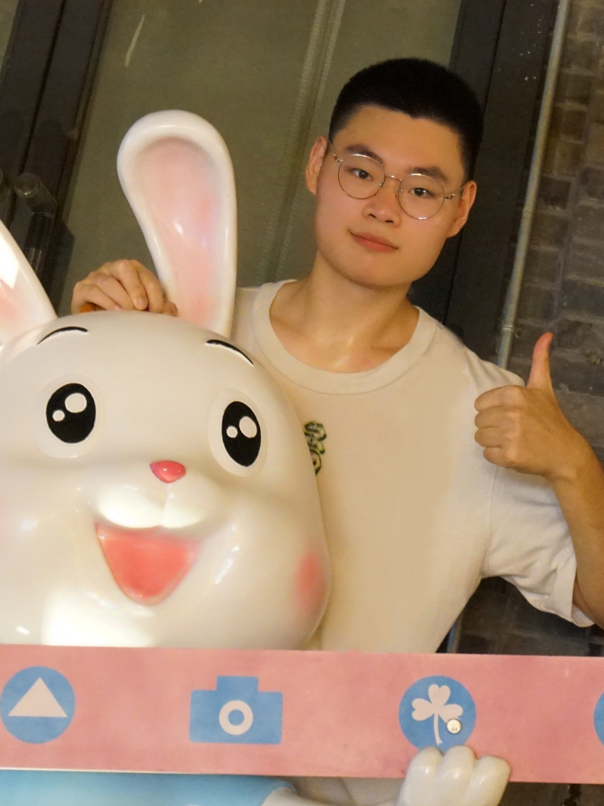
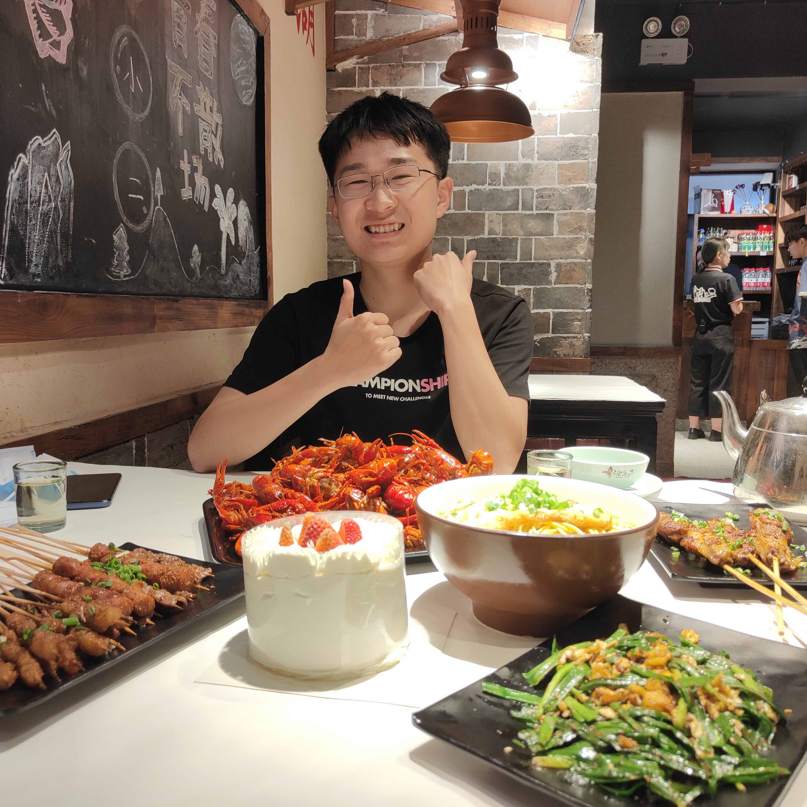
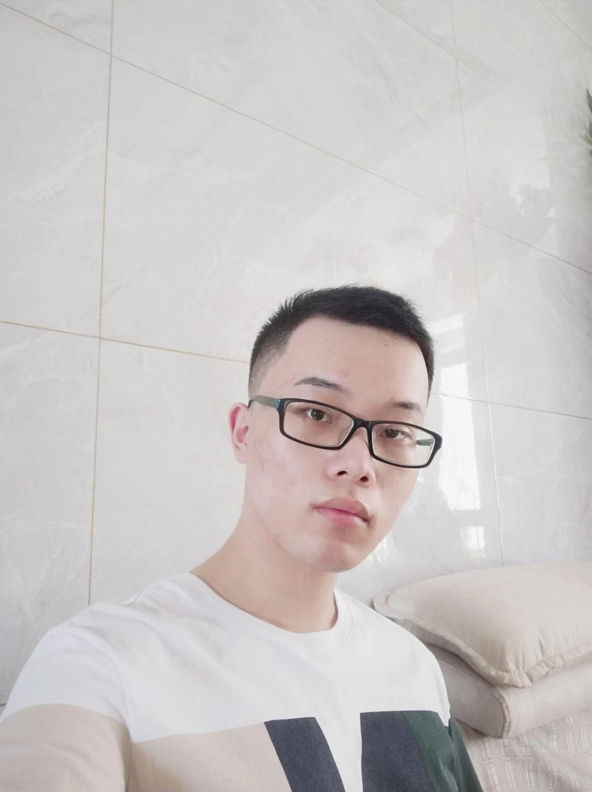

UQ&ML team will focus on the research about machine learning (ML), uncertainty quantification (UQ) and AI for Science.

## Uncertainty quantification (UQ)

UQ is the science of quantitative characterization and estimation of uncertainties in both computational and real world applications. It tries to determine how likely certain outcomes are if some aspects of the system are not exactly known. (from Wiki)

## 关于招生
每年招收两名硕士生（学位可以是数学，统计学或应用统计学），欢迎具有数学、统计学、物理学或计算机背景且对统计计算、不确定性量化、机器学习等相关领域感兴趣的同学报考。

关于 UQ&ML 小组的几点提示：

- 每周定期举行组会，进行文献分享和课题进展讨论。每位成员负责一个独立课题，要求具备较强的自驱力和坚韧性。
- 成员需具备一定的 Python 编程能力，部分课题还需掌握 C++。对于希望毕业后从事算法岗位的同学，这是一次极好的实践机会。
- 毕业要求为撰写具有一定创新性的毕业论文。
- 硕士毕业后，优秀成员有机会推荐至英国、美国或香港的高校继续深造。欢迎有志于科研的同学加入我们。

## People

###  Ph.D. students
-  Yufan Chen (2024-present)
-  Shiyang Bian (2024-present)
-  Ziyan Huang (2024-present)
-  Hongji Wang (joint with Prof. Tiexin Guo, 2023-present)
-   Kunyu Wu (joint with Prof. Yong Jiao, 2024-present)
###  M.S. students

-  Xiao Zhang (joint with Prof. Dejian Zhou, 2022-present)
-  Mengyao Liu (joint with Prof. Yong Jiao, 2022-present)
-  Pucheng Tang (joint with Prof. Yong Jiao, 2022-present)
-  Jiale Xu (2023-present)
-  Beibei Chen (2023-present)
-  Zhiwen Xiao (2023-present)
-  Jinfu Ye (2023-present)

### Former M.S. students

<!--  -->
- Ying Zhou (joint with Prof. Lian Wu, 2020-2022. Future carrer: Ph.D, Central South University)
<!-- -  -->
- Hongji Wang (joint with Prof. Tiexin Guo, 2021-2023. Future carrer: Ph.D, Central South University)
<!-- -  -->
- Zheng Hu (joint with Prof. Tiexin Guo, 2021-2023.  Future carrer: government staff)
<!--  -->
- Jingyu Yang (joint with Prof. Hebai Chen, 2021-2024.  Future carrer: ioe)
<!--   -->
- Kunyu Wu (joint with Prof. Yong Jiao, 2021-2024. Future carrer: Ph.D, Central South University)
<!--  -->
- Juan Cheng (joint with Prof. Yuanyuan Liu, 2021-2024)
<!--  -->
- Run Zhang (joint with Prof. Junping Li, 2022-2024)
  
### Former undergraduate students

- Qibiao Zhang (2020, M.S., Renmin University of China)
- Yutong Gan (2020, M.S., Hokkaido University)
- Chengling Feng (2020, M.S., Shanghai Jiao Tong University)
- Yuchong Wang (2021, M.S., National University of Singapore)
- Zirui Li (2022, North China Electric Power University)
- Xiao Zhang(2022, M.S., Central South University)
- Dezhao Yang(2022, M.S., The Chinese University of Hong Kong, Shenzhen)
- Zhiwen Xiao (2023, M.S., Central South University)
- Jinfu Ye (2023, M.S., Central South University)
- Yuanyuan Cao (2023, M.S., Shanghai University of Finance and Economics)
- Yueqing Yuan (2023, M.S., Xiamen University)
- Hongyi Guo (2023, M.S., Shenzhen University)
- Yu Fu （2024, M.S.）
- Chuyun Peng （2024, M.S., Sun Yat-sen University）
- Yihang Yin (2024, M.S., The University of Edinburgh)
- Shanmei Zhong (2024, M.S., Peking University)
- Wei Zhou (2024, M.S., Zhejiang University)
- Yinzhi Wang (2024, M.S., Shanghai University of Finance and Economics)

### Team building
 BBQ (Nov. 1, 2023)

 

Vacation at a Garden Villa (Jun. 21, 2023)

 
 
Hiking at Changsha Yanghu National Wetland Park (Oct 18, 2022)

 

UQ Team building (May. 20, 2024)

 